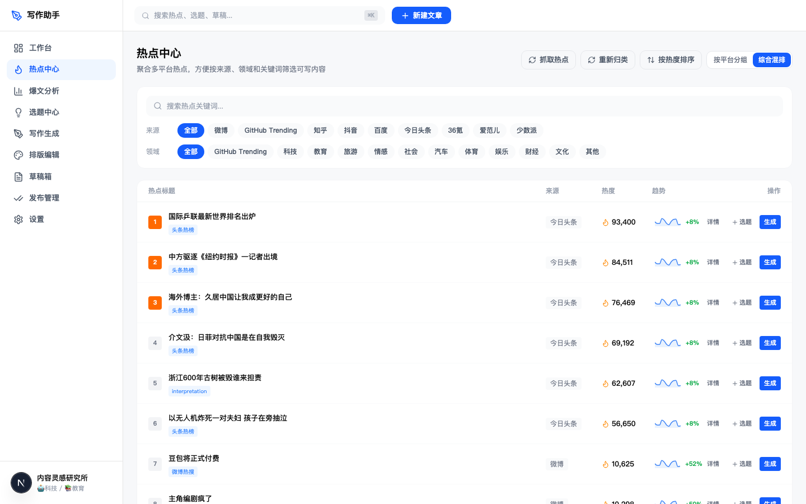
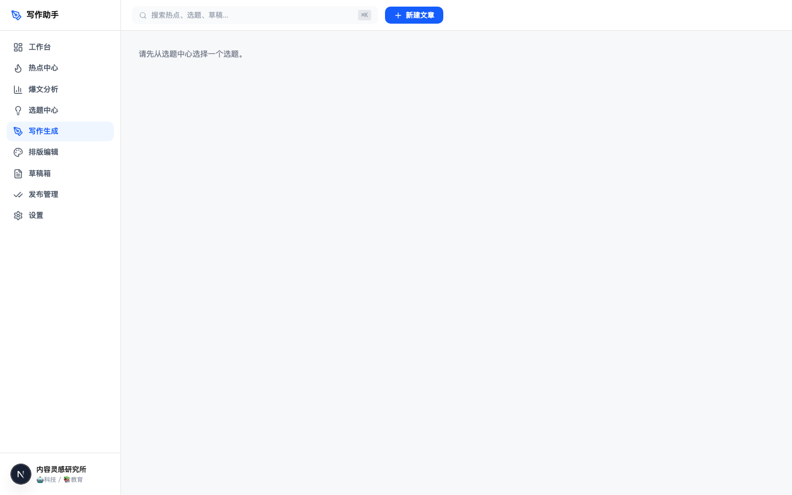
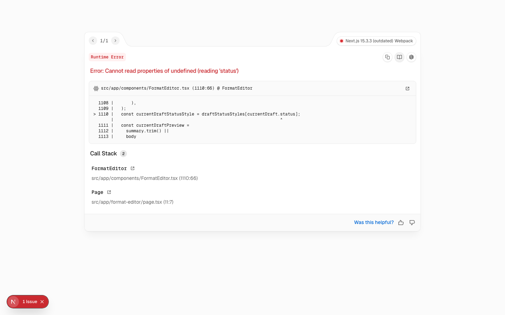

# ✍️ Writing Assistant — AI-Powered Content Creation Platform

A full-stack writing assistant for Chinese content creators, integrating real-time trending topics from 9+ platforms with AI-powered writing, analysis, and publishing workflows.

## 📸 Demo

<!-- Add screenshots here -->

| Hot Topics | AI Writing | Format Editor |
|:---:|:---:|:---:|
|  |  |  |

> 💡 Run `npm run dev` to see it in action!

## 🎯 What It Does

Writing Assistant streamlines the entire content creation pipeline:

1. **Discover** → Real-time trending topics from Weibo, Twitter/X, Zhihu, Douyin, Baidu, 36Kr, and more
2. **Analyze** → AI-driven viral article analysis and topic selection
3. **Write** → Multi-model AI writing with title/outline/body/rewrite support
4. **Format** → Rich text editor with WeChat-ready formatting
5. **Publish** → Draft management, review workflow, and publishing pipeline

## ✨ Key Features

### 📊 Hot Topics Aggregation
- **9+ Sources**: Weibo, Twitter/X, Zhihu, Douyin, Toutiao, Baidu, 36Kr, SSPai, iFanr
- **Smart Fallbacks**: Automatic fallback from official APIs to scraping to RSS
- **Database Caching**: Prisma + Supabase Postgres for persistent storage
- **One-Click Refresh**: Manual refresh with automatic deduplication

### 🤖 AI Writing Engine
- **Multi-Model Support**: Compatible with OpenAI, Qwen/DashScope, DeepSeek, OpenRouter, SiliconFlow
- **Task-Specific Models**: Different models for titles, outlines, body text, and rewriting
- **Configurable Pipeline**: Fine-grained control via `AI_MODEL_TITLE`, `AI_MODEL_OUTLINE`, etc.
- **Graceful Degradation**: App works without AI config;写作 features show clear error messages

### 📝 Content Pipeline
- **Topic Center**: AI-assisted topic selection and categorization
- **Article Analysis**: Viral article pattern recognition and insights
- **Draft Management**: Full CRUD with version history
- **Format Editor**: WeChat-compatible rich text formatting
- **Review Center**: Content review and approval workflow
- **Publishing**: Direct publishing to WeChat Official Account

## 🛠️ Tech Stack

- **Frontend**: Next.js 15 + TypeScript + Tailwind CSS + shadcn/ui
- **Backend**: Next.js API Routes + Prisma ORM
- **Database**: Supabase PostgreSQL
- **AI**: OpenAI-compatible APIs (Qwen, DeepSeek, etc.)
- **State Management**: Zustand

## 🚀 Quick Start

### Prerequisites
- Node.js 18+
- Supabase account (or any PostgreSQL database)
- AI API key (Qwen, OpenAI, DeepSeek, etc.)

### Installation

```bash
git clone https://github.com/lenslp/writing-assistant.git
cd writing-assistant
npm install
```

### Configuration

Copy `.env.local.example` to `.env.local` and fill in:

```bash
# Database
DATABASE_URL=postgresql://...

# Supabase (optional, for auth)
NEXT_PUBLIC_SUPABASE_URL=https://xxx.supabase.co
NEXT_PUBLIC_SUPABASE_PUBLISHABLE_KEY=xxx

# AI Provider (any OpenAI-compatible API)
AI_API_KEY=your-api-key
AI_BASE_URL=https://dashscope.aliyuncs.com/compatible-mode/v1
AI_MODEL=qwen3.5-plus

# Hot Topics Sources (optional)
HOTLIST_TWITTER_RSSBRIDGE_BASE_URLS=https://rss-bridge.org/bridge01/
ZHIHU_COOKIE=your-cookie  # Optional, improves stability
```

### Database Setup

```bash
npx prisma generate
npx prisma db push
```

### Run

```bash
npm run dev
```

Visit [http://localhost:3000](http://localhost:3000)

## 📁 Project Structure

```
writing-assistant/
├── src/
│   ├── app/
│   │   ├── api/              # API routes
│   │   │   ├── hot-topics/   # Trending topics aggregation
│   │   │   ├── ai/           # AI writing endpoints
│   │   │   ├── drafts/       # Draft management
│   │   │   └── wechat/       # WeChat publishing
│   │   ├── hot-topics/       # Hot topics dashboard
│   │   ├── writing/          # AI writing interface
│   │   ├── format-editor/    # Rich text editor
│   │   ├── drafts/           # Draft management
│   │   ├── article-analysis/ # Viral article analysis
│   │   ├── topic-center/     # Topic selection
│   │   ├── review-center/    # Content review
│   │   ├── published/        # Publishing management
│   │   └── settings/         # Configuration
│   └── components/           # Reusable UI components
├── prisma/                   # Database schema
├── supabase/                 # SQL migrations
└── guidelines/               # Writing guidelines
```

## 🔧 API Reference

### Hot Topics

| Endpoint | Method | Description |
|----------|--------|-------------|
| `/api/hot-topics` | GET | Fetch trending topics (DB first, fallback to live) |
| `/api/hot-topics/refresh` | POST | Force refresh from all sources |

### AI Writing

| Endpoint | Method | Description |
|----------|--------|-------------|
| `/api/ai/write` | POST | Generate content with AI |
| `/api/ai/provider` | GET | List available AI providers |

### Drafts

| Endpoint | Method | Description |
|----------|--------|-------------|
| `/api/drafts` | GET/POST | List or create drafts |
| `/api/drafts/[id]` | GET/PUT/DELETE | Manage single draft |

## 🌐 Supported Hot Topics Sources

| Source | Method | Fallback |
|--------|--------|----------|
| Weibo | Official API | - |
| Twitter/X | RSS-Bridge (TwitScoop) | Multiple bridge instances |
| Zhihu | Official API | RSSHub |
| Douyin | Official API | - |
| Toutiao | Official API | Custom URLs |
| Baidu | API + HTML scraping | - |
| 36Kr | RSS | - |
| SSPai | RSS | - |
| iFanr | RSS | - |

## 🤝 Contributing

Contributions are welcome! Please see [CONTRIBUTING.md](CONTRIBUTING.md) for detailed guidelines.

## 📄 License

This project is open source and available under the [MIT License](LICENSE).

## 🙏 Acknowledgments

- Built with [Next.js](https://nextjs.org/)
- UI components from [shadcn/ui](https://ui.shadcn.com/)
- Database powered by [Supabase](https://supabase.com/)
- AI models via [DashScope](https://dashscope.aliyun.com/) and OpenAI-compatible APIs

---

**Built with ❤️ for Chinese content creators**
